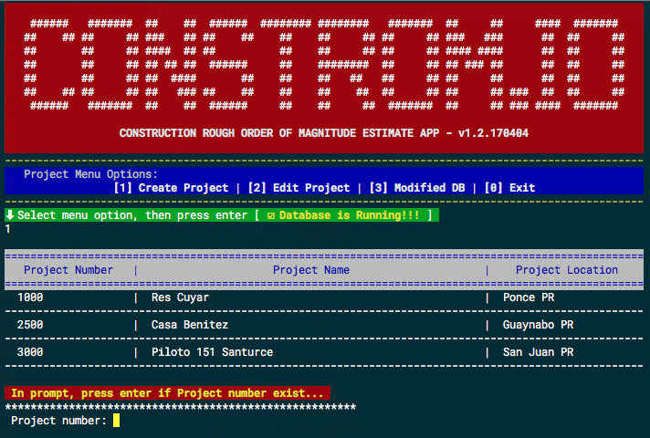
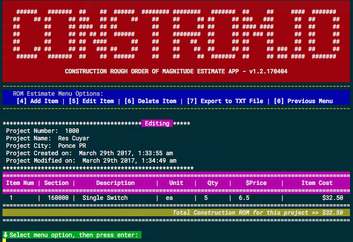
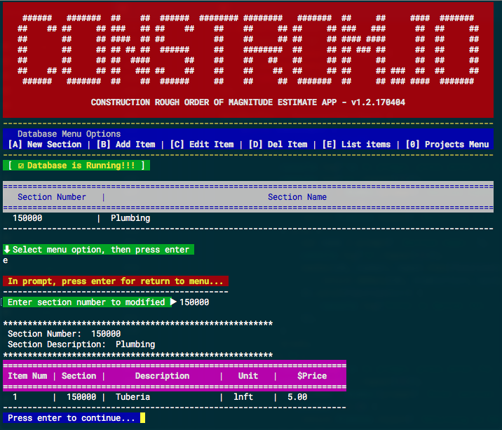

# CONSTROM.io

_Intro to Javascript with Node.js 
Course Final Project 
Arturo Santiago-Rivera 
Codetrotters Academy, San Juan PR 
March 29, 2017_

## Definition

**CONSTROM.io** means **_Construction Rough Order of Magnitude Estimate (ROM Estimate)_**.

ROM estimates are usually based on the estimator’s experience as well as historical data on similar projects.  We may use this kind of estimate for funding requests and budget planning.

## Development

**CONSTROM.io** is entirely programmed in **_Javascript Language_**.  At this moment, the app is executed in the computer terminal using Node.js. We expecting to continue developing the app as a Web App to be accesible in any kind of device. The app programming is developed with the following main components:

☑ MongoDB 
☑ Promises 
☑ Functions 
☑ Class Functions 
☑ Objects Array 
☑ Imports 
☑ NPM Packages

The most challenging of the project's development was being able to understand the logic of **`Promises`** and the management of **`MongoDB`**. These two components of the development were not part of the 2017 Winter Javascript Course Syllabus, so they had to be learned in a week and a half with lot of "trial and error".  I can say that these two components are the basis of the development and implementation of the app.

## Usage from command line

You need _Node.js_ installed in your computer.

Issue command **`npm install`** in your computer terminal in the directory where the app is located to install the require npm packages.

Issue the command **`node constrom.js`** in your computer terminal in the directory where the app is located to run the app.
For no color version, issue the command **`node constrom.js --no-color`**.
 
 
 

 **Figure 1: Constrom.io ScreenShot Project Menu**
 
 
 

 **Figure 2: Constrom.io ScreenShot Project ROM Estimate Items Menu**
 
 
 

 **Figure 2: Constrom.io ScreenShot Items Database Menu**
